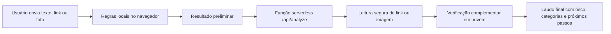

# Confere Agora


**Confere Agora** é um analisador de risco de desinformação para textos, links, manchetes, posts, mensagens e imagens compartilhadas online.

Site público: [confere-agora.vercel.app](https://confere-agora.vercel.app/)

O objetivo do projeto é ajudar pessoas a perceber sinais de alerta antes de compartilhar uma informação, sem substituir agências de checagem, fontes oficiais ou trabalho jornalístico.

## Funcionalidades

- Análise de texto, link e foto.
- Leitura segura de páginas públicas para extrair título, descrição, domínio, autor e data quando disponíveis.
- Verificação complementar em nuvem, sem depender do computador do desenvolvedor.
- OCR pela verificação complementar para identificar texto visível em imagens.
- Classificação por categorias: saúde, política, golpe financeiro, corrente emocional, notícia sem fonte, acusação grave, link suspeito e imagem fora de contexto.
- Laudo curto com risco, motivo principal, sinais encontrados e próximos passos.
- Botão para copiar ou baixar relatório em `.txt`.
- Compartilhamento do laudo e download de imagem do resultado.
- Página visual de relatório pronta para print e compartilhamento.
- Endpoint para bot do Telegram com texto, link e imagem.
- Histórico local das últimas análises no navegador.
- Referências úteis por categoria de risco.
- Medidor de confiabilidade da fonte para links.
- Página interna com explicação do funcionamento, privacidade e arquitetura do projeto.
- Testes automatizados para helpers de produto.
- Testes end-to-end com Playwright para fluxo principal.
- Limite anti-abuso leve na função de análise.
- Fallback por regras locais caso a verificação complementar esteja indisponível.

## Tecnologias

- React
- Vite
- Tailwind CSS
- Lucide React
- Vercel Functions
- API de verificação em nuvem

## Arquitetura



## Como Rodar Localmente

Requisitos:

- Node.js
- pnpm
- chave de verificação em nuvem para ativar a análise complementar

Crie um arquivo `.env`:

```bash
CLOUD_AI_API_KEY=sua_chave
```

Comandos:

```bash
pnpm install
pnpm dev
```

Acesse:

```bash
http://127.0.0.1:5173
```

Testes:

```bash
pnpm test
pnpm test:e2e
```

## Deploy

O projeto está preparado para deploy na Vercel.

Guia: [Deploy e verificação na nuvem](docs/deploy-e-ia-na-nuvem.md)

## Documentação

- [Sobre o projeto](docs/sobre-o-projeto.md)
- [Arquitetura](docs/arquitetura.md)
- [Escopo](docs/escopo.md)
- [Roadmap](docs/roadmap.md)
- [Decisões](docs/decisoes.md)
- [Plano de testes](docs/plano-de-testes.md)
- [Bot para Telegram e WhatsApp](docs/bot-telegram-whatsapp.md)
- [Post para LinkedIn](docs/post-linkedin.md)

## Princípios

- A ferramenta não declara sozinha que algo é verdadeiro ou falso.
- A análise deve ser explicável para o usuário.
- O foco é reduzir compartilhamentos impulsivos.
- Conteúdos sobre pessoas, instituições ou temas públicos recebem cuidado extra.
- Toda decisão importante do projeto deve ser documentada.
