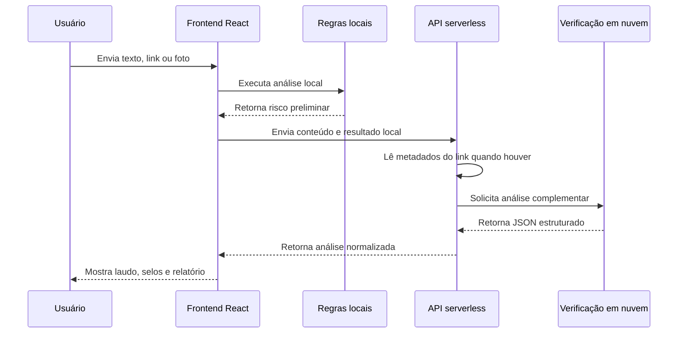

# Arquitetura

## Visão Geral

O projeto usa uma aplicação Vite/React no frontend e funções serverless em `api/` para executar a verificação complementar em nuvem sem expor a chave secreta no navegador.

## Frontend

- `src/App.jsx`: interface, regras locais, preparo de imagem, laudo e relatório.
- `src/styles.css`: fonte, base visual e animação da barra de risco.
- `public/logo-confere-agora.png`: logo do projeto.

## Backend

- `api/analyze.js`: endpoint principal da análise complementar.
- `api/ai-status.js`: checagem pública de disponibilidade.
- `api/_gemini.js`: leitura segura de links, normalização do JSON e chamada da API em nuvem.

## Segurança

- A chave da API fica apenas nas variáveis de ambiente da Vercel.
- Links locais, privados ou de metadados de nuvem são bloqueados antes da leitura.
- O navegador nunca recebe a chave secreta.

## Fallback

Quando a verificação complementar falha, o app mantém o resultado por regras locais e informa que a verificação em nuvem está indisponível no momento.
